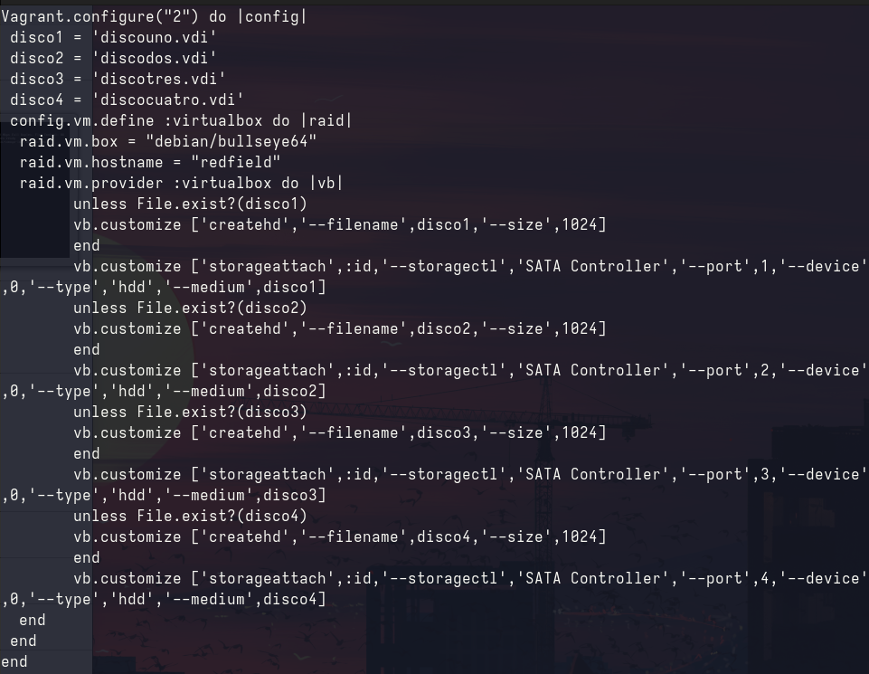
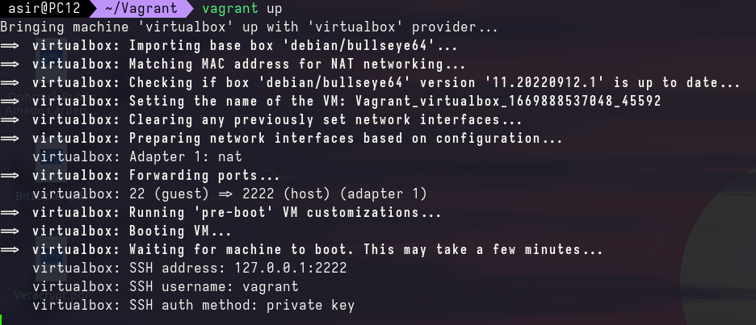
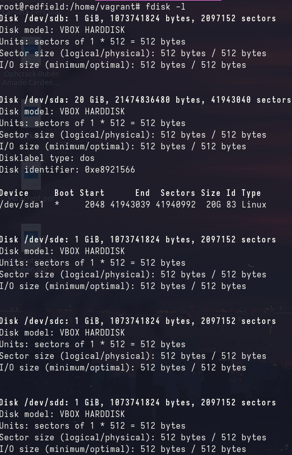
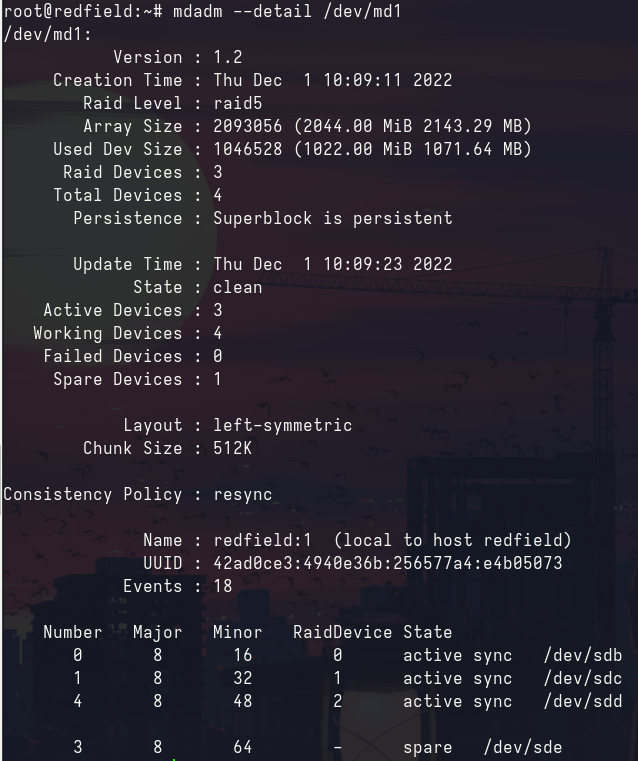

# Índice

Vagrant es una herramienta open source, escrita en ruby, que permite crear entornos virtuales livianos, además de automatizar su creación y gestión. Las máquinas virtuales creadas pueden ser ejecutadas por Virtual-Box, VMWare etc.

## Instalación de Vagrant.

Es necesario instalar Vagrant desde los repositorios de Debian:

``apt install vagrant``

Este paquete también nos instalará el plugin vagrant-libvirt. El cual nos facilitará la tarea.

Es el turno de crear el entorno donde realizaremos la práctica. Vagrant utiliza el término Box para referirse a las imágenes de las máquinas virtuales. Para añadir una imagen se realiza con la siguiente sentencia:

``vagrant box add debian/bullseye64``

Una vez ejecutada la sentencia nos pedirá que administrador de máquinas virtuales deseamos. En mi caso he escogido virtual box.

Donde debian/bullseye64 es la imagen que añadimos.

Los comandos necesarios para la creación de una máquina virtual con vagrant son los siguientes:

- vagrant init: nos crea un fichero predeterminado. Lo utilizaré como inicio para crear mi máquina virtual.

Configuracion maquina vagrant:

He creado cuatro discos virtuales los cuales me servirán para la creación del Raid5.

- vagrant up: Nos ejecutará la máquina.

- vagrant halt: Para la máquina.

- vagrant destroy: Elimina la máquina.

## Creación de un raid-5

Para conectarnos a la máquina virtual debemos utilizar el siguiente comando

``vagrant ssh``

Para ponernos como root

``sudo su``

A conituación debemos visualizar los discos para crear el raid5.

Una vez hemos conocido la nomenclatura de los discos podemos crear el raid 5.(Los discos que utilizare en el raid son sdb,sdc,sdd,sde). Pero antes será necesario instalar el paquete mdadm

``apt update && apt upgarde && apt install mdadm``

``mdadm --create /dev/md1 --level5 --raid-devices=3 /dev/sdb /dev/sdc /dev/sdd --spare-devices=1 /dev/sde``

El raid 5 utilizará tres discos para hacer las copias del raid y uno que funcionará como hot-spare. Es decir, en caso de fallo de un disco el hot-spare lo substituirá.

## Diferencias entre Raid1 y Raid5

El Raid5 utiliza la paridad y la suma de comprobación para mejorar la redundancia y necesita un mínimo de tres discos para repartir la información, puediendo utilizar la totalidad de la memoria. Por otro lado, el Raid1 necesita un mínimo de dos discos, realizando una copia de todo el contenido del primer disco al segundo disco. Perdiendo así, la mitad de toda la capacidad de memoria total. En cambio, el Raid1 al no tener redundancia, mejora su rendimiento de lectura y escritura en comparación con el Raid5.
